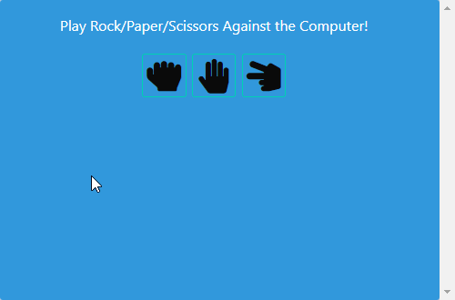

# Rock-Paper-Scissors
## Licensing:
#### _MIT License_
## Description
This app allows the user to play Rock/Paper/Scissors against the computer. Local storage is used to compare the user's choice to the computer's random choice to determine the winner.

* WHEN the user clicks the icon of a hand holding up rock, paper, or scissors
* THEN the computer randomly chooses a response that is rendered to the screen
* WHEN the user and computer choose the same
* THEN "Tie" is shown
* WHEN the computer wins
* THEN "Computer Wins" is shown
* WHEN the user wins
* THEN "You Win" is shown
* WHEN the user clicks the "play again" button
* THEN the screen refreshes and the user can play again

## Table of Contents

* [Usage](#Usage)
* [Technologies](#Technologies)
* [Questions](#Questions)

## Usage
#### _Deployed App_
https://shelleymcq.github.io/Rock-Paper-Scissors/

## Technologies
Created with HTML, CSS & Bulma, JavaScript & jQuery

## Questions 
https://github.com/shelleymcq or email me at shelleymcq.dev@gmail.com
